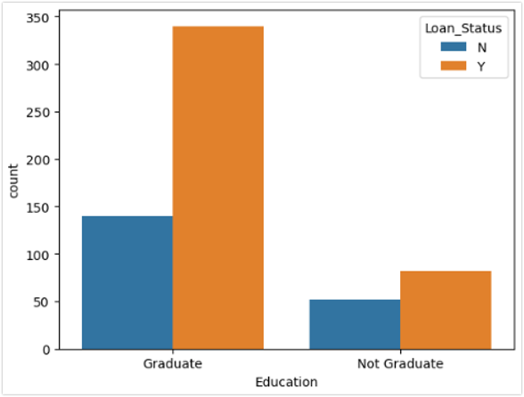
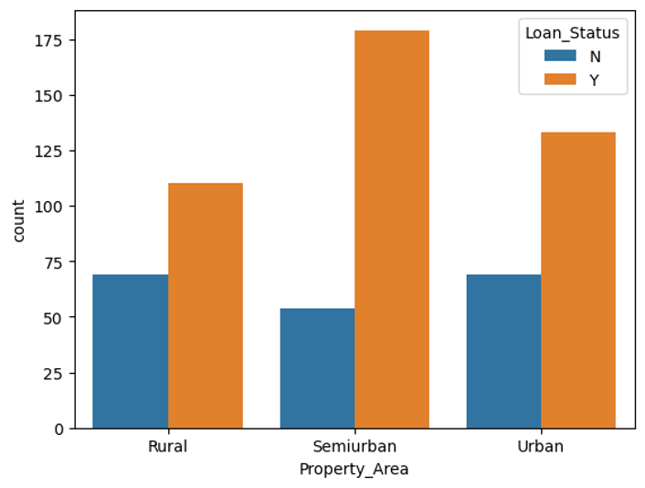
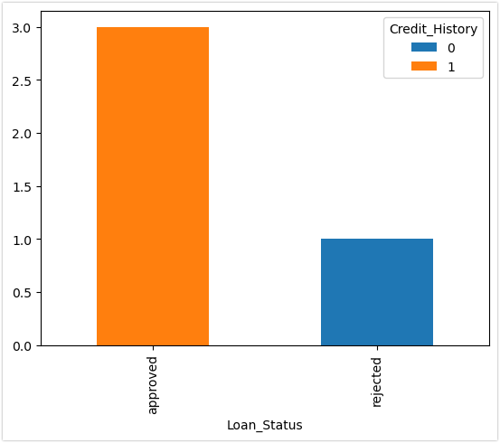
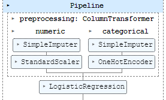
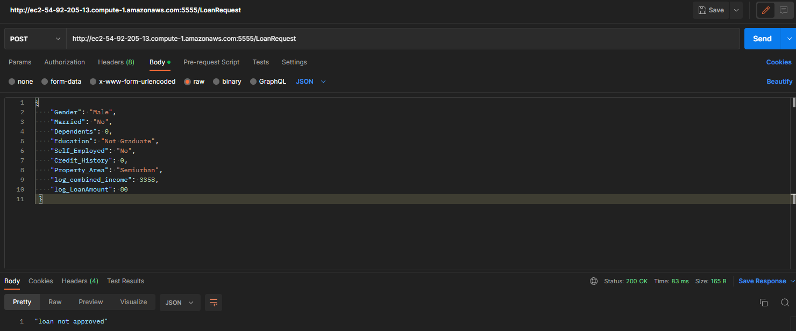

## Project/Goals
In this project we are given a dataset with loan request, and various informatation about the person, such as income, education status, etc. My goal is to develop a model that takes the necessary information and makes a perdiction on wether a loan will be granted or not

## Hypothesis
Applicants with a combination of higher education, income, credit history and living area are more likely to be approved for a loan

## EDA 
I went through the data to comfirm or deny my hypothesis

graduates are much more likely to get a loan approved

Property only has a mild impact on loan status

Credit History has a large impact on if a loan will

## Process
Data retrieval
cleaning - removing NANS
exploration - looking at the data, comfirming/denying hypothesis
Modeling and feature selection - decided to use only logistic regression
Deployment - managed to set up deployment to AWS but isn't it working entirely yet

## skills used:
Data Preparation
Feature Engineering
Supervised Learning
Pipelines
Model Persistance
Flask - building an API
Deployment to Cloud (AWS)

## Results/Demo

## Challanges 
Given the time constaints I wasn't really able to execute the project, I later realized that I lost all my work and accidentally submited a blank template, as I was redoing the project AWS was giving me many issues and I couldn't quite finish the deploying my work

## Future Goals
The predictor model is weak and given more time I could improve it
